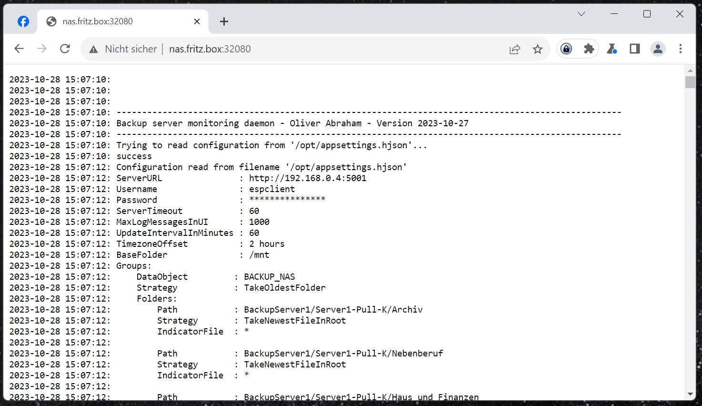
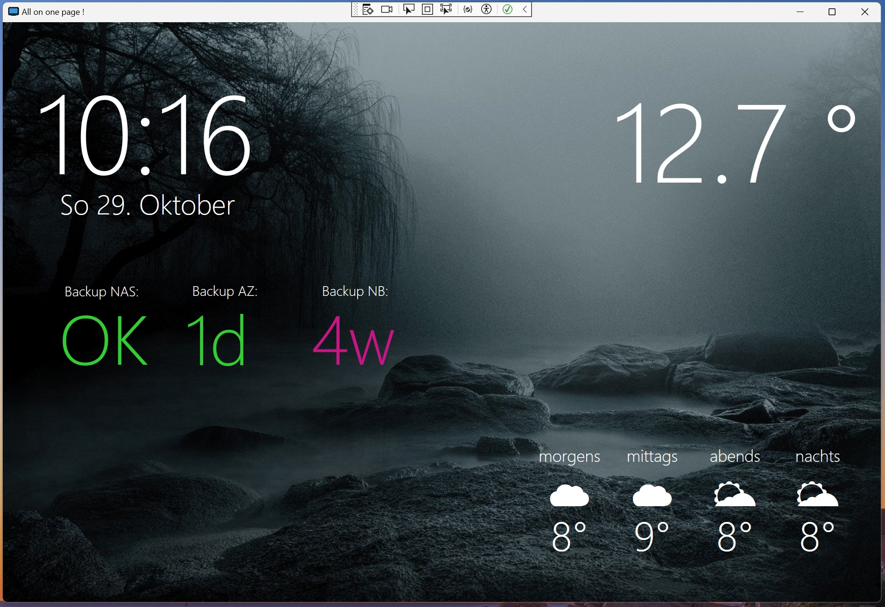
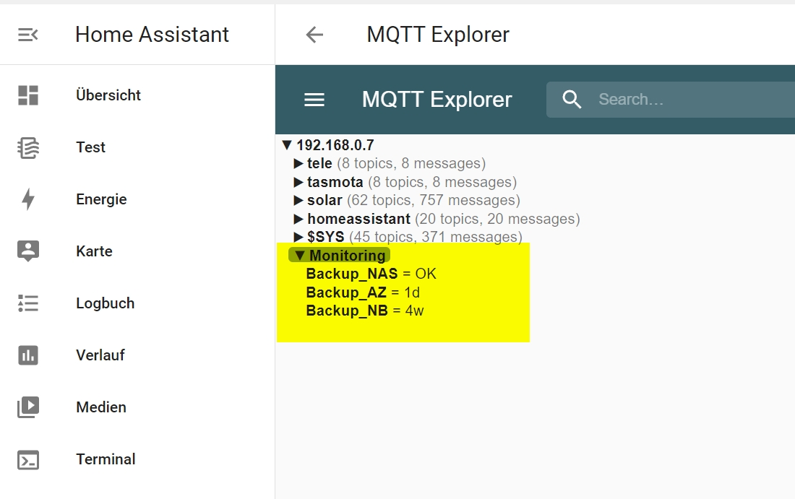

# Abraham.BackupServerDaemon

   


## OVERVIEW

Monitors a backup server and sends monitoring data to an MQTT broker.
Checks that every backup job has been executed and that backups are not too old.
To use it, you need an MQTT broker, for example Mosquitto (https://mosquitto.org/).
Mosquitto can also be used inside Homeassistant. (https://www.home-assistant.io/).


## IDEA

On the file server, I've setup a task that creates a new, empty file called test.eye 
in the root dir of every shared folder, every night. On the backup server, I'm monitoring 
the age of this file. If it's older than 24 hours, something went wrong with the backup job
and I get an alarm.

## LICENSE

Licensed under Apache licence.
https://www.apache.org/licenses/LICENSE-2.0


## COMPATIBILITY

The application was build with DotNET 6.
You can run it as a command line application on Windows and Linux, or as a container everywhere.


## INSTALLATION

You need to edit the appsettings.hjson file with your configuration first.
Take my example file as a guideline.

### appsettings.hjson

On startup, the application will search first for the file in /opt/appsettings.hjson, 
then if not found in the current directory. That means if your're running the docker container,
you can mount the file from your host into the container in /opt.
Or, if you decide to compile it by yourself and run it as a command line application, 
you can put the file in the bin directory.

```
{
    ServerURL               : ""
    Username                : ""
    Password                : ""
    MqttServerURL           : "<YOUR MQTT BROKER URL>"
    MqttUsername            : "<YOUR MQTT BROKER USERNAME>"
    MqttPassword            : "<YOUR MQTT BROKER PASSWORD>"
    ServerTimeout           : 60
    UpdateIntervalInMinutes : 1
    TimezoneOffset          : 2
    BaseFolder              : "/mnt"
    Groups: [
    {
        DataObjectName      : ""
        MqttTopic           : "Monitoring/Backup_NAS"
        Folders: [
        {
            Path            : "BackupServer1/Server1-Pull-K/Archiv"
            Strategy        : "TakeNewestFileInRoot"
            IndicatorFile   : "*"
        }
        ]
        Strategy            : "TakeOldestFolder"
        Ratings: [
            { AgeDays:       0, Result : "OK"  },
            { AgeDays:       1, Result : "1d"  },
            { AgeDays:       2, Result : "2d"  },
            { AgeDays: 9999999, Result : "old" }
        ]
    }
    ]
}
```
Please find a more detailed description of the configuration at the end of this document.

This minimal configuration file will work ith your backup folder mounted into the container at /mnt.
It will search for files in the folder "BackupServer1/Server1-Pull-K/Archiv".
It will pick the newest file in the root of the folder and take its age.
I have a file called test.eye in every root folder, it gets updated every time a backup job is executed.


### docker-compose

Start a docker container with a docker-compose.yml file like this:

```
version: "3"
services:
  backupserverdaemon:
    image: ghcr.io/oliverabraham/backupserverdaemon/backupserverdaemon:latest
    container_name: backupserverdaemon
    ports:
      - 32080:80
    volumes:
      - /home/pi/backupserverdaemon/appsettings.hjson:/opt/appsettings.hjson
      - /srv/dev-disk-by-uuid-436974ef-70d4-45cf-885c-0aedcd80d737:/mnt
    restart: unless-stopped
```


### marking the shared folders

On your file server, you should set up a scheduled task that creates a file called test.eye in every shared folder 
every night. (or in the frequency you're doing your backups)

On a windows server:
```
del     "K:\MySharedFolder\test.eye"
echo . >"K:\MySharedFolder\test.eye"
```

On a linux server:
```
rm     "/MySharedFolder/test.eye"
cat . >"/MySharedFolder/test.eye"
```


## ABOUT THE WEB INTERFACE
The app has a small web interface that shows the recent log output. 
(Please forgive me, that wasn't in my focus, also adding a log file hasn't been done yet)


## ABOUT MQTT
To use my app, you need an MQTT broker, for example Mosquitto (https://mosquitto.org/).
Mosquitto can also be used inside Homeassistant. (https://www.home-assistant.io/).
The API documentation can be found at https://mqtt.org/
To get started with MQTT targets, you can start with my demo app in this repository: https://github.com/OliverAbraham/Abraham.MQTTClient. 
It will simply send a message to the broker and then exit.
To display MQTT data nicely on a dashboard, try out my dashboard app: https://github.com/OliverAbraham/AllOnOnePage


## AUTHOR

Oliver Abraham, mail@oliver-abraham.de, https://www.oliver-abraham.de
Please feel free to comment and suggest improvements!


## SOURCE CODE

The source code is hosted at:
https://github.com/OliverAbraham/BackupServerDaemon


## appsettings file configuration

- ServerURL, Username, Password
These are the parameters to connect to my personal home automation server "HNServer".
This is useless for you because I haven't published this project yet.

- MqttServerURL, MqttUsername, MqttPassword
These are the parameters to connect to your MQTT broker.

- ServerTimeout
The time in seconds before giving up :-)

- UpdateIntervalInMinutes
The frequency in which the application will check the backup server.

- TimezoneOffset
This is just for the display of the last update time in the web interface.
I didn't manage to set the timezone of my container in Openmediavault correctly, so I'm using this offset to correct the time.
Put in a number of hours, for example 2 for Central European Time.

- BaseFolder
This is meant to be the base folder where you can reach all your backups. I am using Openmediavault and mounted my backup folder at /mnt.
Take my docker-compose file as an example.

- Groups

For every group, the app will send one status message to the Monitoring Server.
It will check all the folders in the group and summerize the findings, according to the rules.
In my system, I have several folders to store my backups. For every folder I am taking the newest file, which will be the test.eye or the lastest incremental backup file.
Then, the app will summerize the results for all folders in the group.
I take the oldest folder. So for example, if I have 3 folders that were backupped today and one folder that has a problem, I will get that age as a warning.


### Folder configuration
- Path: The location, relative to the BaseFolder
- Strategy: "TakeNewestFileInRoot" or "TakeOldestFileInRoot"
- IndicatorFile: "\*", or "test.eye" or "backup_*.zip" or whatever you want to use as an indicator that the backup job has been executed.


### Group configuration
- DataObject: only for my personal home automation server
- MqttTopic: the destination topic for the status message
- Strategy: "TakeOldestFolder" or "TakeNewestFolder"
- Ratings: Here you can put a set of rules to summerize the age in days to a status message.

# SCREENSHOTS


This is a picture of my dashboard where the results are displayed:
(dashboard can be found in my repo "AllOnOnePage")


This is a picture of my MQTT broker receiving the values:



# MAKE A DONATION !

If you find this application useful, buy me a coffee!
I would appreciate a small donation on https://www.buymeacoffee.com/oliverabraham
<a href="https://www.buymeacoffee.com/app/oliverabraham" target="_blank"></a>
